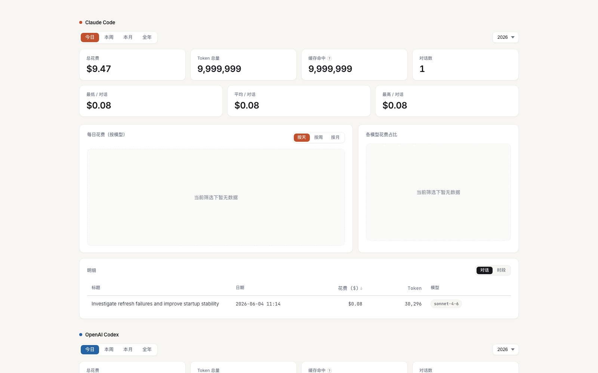

# AI Usage Dashboard

`@csevav/ai-usage-dashboard`

> 一个可视化的 **Claude Code + OpenAI Codex** 用量看板。基于 [`ccusage`](https://www.npmjs.com/package/ccusage) 增强，新增 Codex 数据、按对话排行、中文界面、系统本地时区等功能。当前主要支持 **Codex** 和 **Claude Code**。
>
> A visual usage dashboard for **Claude Code + OpenAI Codex** — built on top of [`ccusage`](https://www.npmjs.com/package/ccusage), with Codex support, per-conversation ranking, Chinese UI, and system-local timezone display. It currently targets **Codex** and **Claude Code** workflows.

 



---

## 🎯 适用场景 / When to use

适合这些请求：

- 打开本地 AI 用量看板
- 对比 Claude Code 和 Codex 的费用或 token 趋势
- 按天 / 周 / 月查看使用变化
- 按对话查看用量排行，而不是只看终端总数
- 刷新或重建 dashboard，并排查为什么某些面板是空的

不适合这些请求：

- 只要一个简单总数，不需要浏览器看板
- 纯前端页面开发，与 AI usage 无关
- 没有本地 Claude / Codex 使用记录，却只想看静态示例图

## ✅ 启动前检查 / Quick preflight

推荐先确认这 3 件事：

```bash
ccusage --version
ccusage --help
python3 --version
```

最低前提：

- `ccusage >= 20.0.6`
- `ccusage --help` 里能看到 `codex` 子命令
- 本机已有本地使用记录：`~/.claude/projects` 或 `~/.codex/sessions`

## ✨ 功能 / Features

| | 原版 `ccusage-ui-dashboard` | 本项目 |
|---|:---:|:---:|
| Claude Code 用量 | ✅ | ✅ |
| OpenAI Codex 用量 | ❌ | ✅ |
| Claude vs Codex 综合对比 | ❌ | ✅ |
| 按**对话**统计 / 排行（带标题） | ❌ | ✅ |
| 「时段 / 对话」明细可切换 | ❌ | ✅ |
| 表头点击排序 | ❌ | ✅ |
| 缓存命中 hover 说明 | ❌ | ✅ |
| 中文 UI | ❌ | ✅ |
| 系统本地时区显示 | ❌ | ✅ |
| 周柱状图按周一日期标注 | ❌ | ✅ |

---

## 📦 安装 / Install

```bash
npm install -g @csevav/ai-usage-dashboard
```

安装后会自动：

1. 把模板和构建脚本拷到 `~/.ai-usage-dashboard/`
2. 在 `~/.claude/commands/` 创建 `ai-usage.md`，作为 Claude Code 的快捷集成

稳定启动前提：

- 当前看板按 **`ccusage >= 20.0.6`** 适配
- 如果你的 `ccusage` 版本低于 `20.0.6`，请先升级，再重试看板
- 如果要看 Codex 数据，请确认 `ccusage --help` 里已经出现 `codex` 子命令
- 如果你的环境不适合每次通过 `npx` 拉取依赖，也可以先本地安装一次 `ccusage`

可选的本地安装方式：

```bash
npm install -g ccusage
```

## 🚀 使用 / Usage

推荐用法：安装后直接运行：

```bash
ai-usage-dashboard
```

这是跨平台的主入口，适用于 **macOS / Linux / Windows**。

如果你是本地开发或直接从仓库运行：

```bash
bash ./build.sh
```

Windows PowerShell:

```powershell
./build.ps1
```

也支持直接用 `npx` 运行：

```bash
npx @csevav/ai-usage-dashboard
```

例如：

```bash
npx @csevav/ai-usage-dashboard --no-open
```

如果安装后页面能打开，但 Codex 面板为空，先检查本机 `ccusage` 版本和 `codex` 子命令是否可用。
如果版本低于 `20.0.6`，先升级 `ccusage` 来解决，再判断是不是本地没有使用记录。

如果你在用 **Claude Code**，也可以直接输入：

```
/ai-usage
```

会自动构建并在浏览器打开看板。

支持参数：
- `--no-open` — 只生成 HTML，不自动打开浏览器
- `--no-summary` — 不在终端打印 markdown 摘要

## 平台支持 / Platform support

- **macOS / Linux**：主功能支持
- **Windows**：主功能支持，推荐在 PowerShell 中运行 `./build.ps1`，或直接使用安装后的 `ai-usage-dashboard`
- **后台常驻 / daemon**：
  - macOS：通过 LaunchAgent 保持固定地址常驻
  - Windows：通过 Task Scheduler 保持固定地址常驻
  - Linux：通过 `systemd --user` 保持固定地址常驻

## 固定地址常驻 / Fixed Local Address

这个项目默认使用固定地址：

```bash
http://127.0.0.1:46327
```

如果你希望登录后后台常驻，并且只在手动点击页面里的“刷新数据”按钮时才重新拉数据，可以安装本地 daemon：

```bash
ai-usage-dashboard-daemon install
```

- macOS 上会创建 LaunchAgent
- Windows 上会创建 Task Scheduler 任务
- Linux 上会创建 `~/.config/systemd/user/ai-usage-dashboard-daemon-46327.service`

常用命令：

```bash
ai-usage-dashboard-daemon status
ai-usage-dashboard-daemon restart
ai-usage-dashboard-daemon stop
ai-usage-dashboard-daemon uninstall
```

说明：

- 常驻的是本机本地网页服务，不是云端服务
- 仅仅打开 `127.0.0.1:46327` 不会自动刷新数据
- 只有点击页面里的刷新按钮，才会重新执行统计命令
- 默认端口是 `46327`；如需改端口，可先设置 `AI_USAGE_DASHBOARD_PORT`
- Windows daemon 默认任务名是 `AIUsageDashboardDaemon-46327`
- Linux daemon 默认 service 名是 `ai-usage-dashboard-daemon-46327.service`

## Skill 用法 / Use as a Codex skill

这个仓库现在也可以直接作为 **Codex skill: AI Usage Dashboard** 使用。

核心入口是：

```bash
python3 ~/.codex/skills/ai-usage-dashboard/scripts/build_dashboard.py --source-dir ~/.codex/skills/ai-usage-dashboard --home ~/.ai-usage-dashboard
```

当用户表达这些意图时，这个 skill `AI Usage Dashboard` 很适合触发：

- 想打开可视化用量看板
- 想看 Codex / Claude Code 的 token 或费用趋势
- 想按对话查看用量排行
- 想要浏览器里的 dashboard，而不是纯终端输出

如果你是本地维护这个 skill，关键文件是：

- `SKILL.md` — skill 触发说明
- `agents/openai.yaml` — skill 的界面名称和默认提示词
- `build.sh` — 实际构建入口

## 🔧 依赖 / Requirements

- **Node.js** ≥ 18（用于 `npx`）
- **Python 3**（用于解析本地日志和构建本地页面）
- **macOS / Linux / Windows**（主功能支持；daemon 管理入口支持三端，其中 Linux 依赖 `systemctl --user`）
- 外部 CLI 依赖只有一个：
  - [`ccusage`](https://www.npmjs.com/package/ccusage)

数据来源命令是这样分的：

- **Claude Code**：用 `ccusage claude ...`
- **OpenAI Codex**：用 `ccusage codex ...`

也就是说，Codex 这里依赖的是 **`ccusage` 里的 `codex` 子命令**，不是单独的 `ccusage-codex` 包。

如果你要看 **Codex** 数据，请确认本机 `ccusage >= 20.0.6`，并且已经支持 `ccusage codex ...`。
低于这个版本，或者直接报 `Command not found: codex`，都请先升级 `ccusage`，否则看板会只显示 Claude 数据或把 Codex 面板渲染为空。

快速检查方法：

```bash
ccusage --version
ccusage --help
```

如果 `--help` 里已经出现 `codex` 子命令，说明当前版本支持 Codex focused command。

构建脚本会自动通过 `npx --yes` 调用上述包，无需额外安装。

> 当前这份包主要面向两种使用方式：**Codex 里直接运行 shell 命令**，以及 **Claude Code 里的 slash command 集成**。

## 🗂 数据来源 / Data sources

- **Claude Code**：调用 `npx ccusage claude daily/weekly/monthly/session --json` 获取正式用量数据；从 `~/.claude/projects/*/*.jsonl` 补齐对话标题和精确时间
- **OpenAI Codex**：调用 `npx ccusage codex session --json` 拿到对话级用量；从 `~/.codex/sessions/.../rollout-*.jsonl` 提取首条用户输入作为对话标题
- 时间跟随使用者的系统本地时区展示

## 🤝 致谢 / Credits

- 灵感和基础结构来自 [`ccusage-ui-dashboard`](https://www.npmjs.com/package/ccusage-ui-dashboard) by okrasn
- 数据采集依赖 [`ccusage`](https://www.npmjs.com/package/ccusage) by ryoppippi；Codex 数据使用同一工具的 focused command

## 📄 License

MIT © Luke Mei
